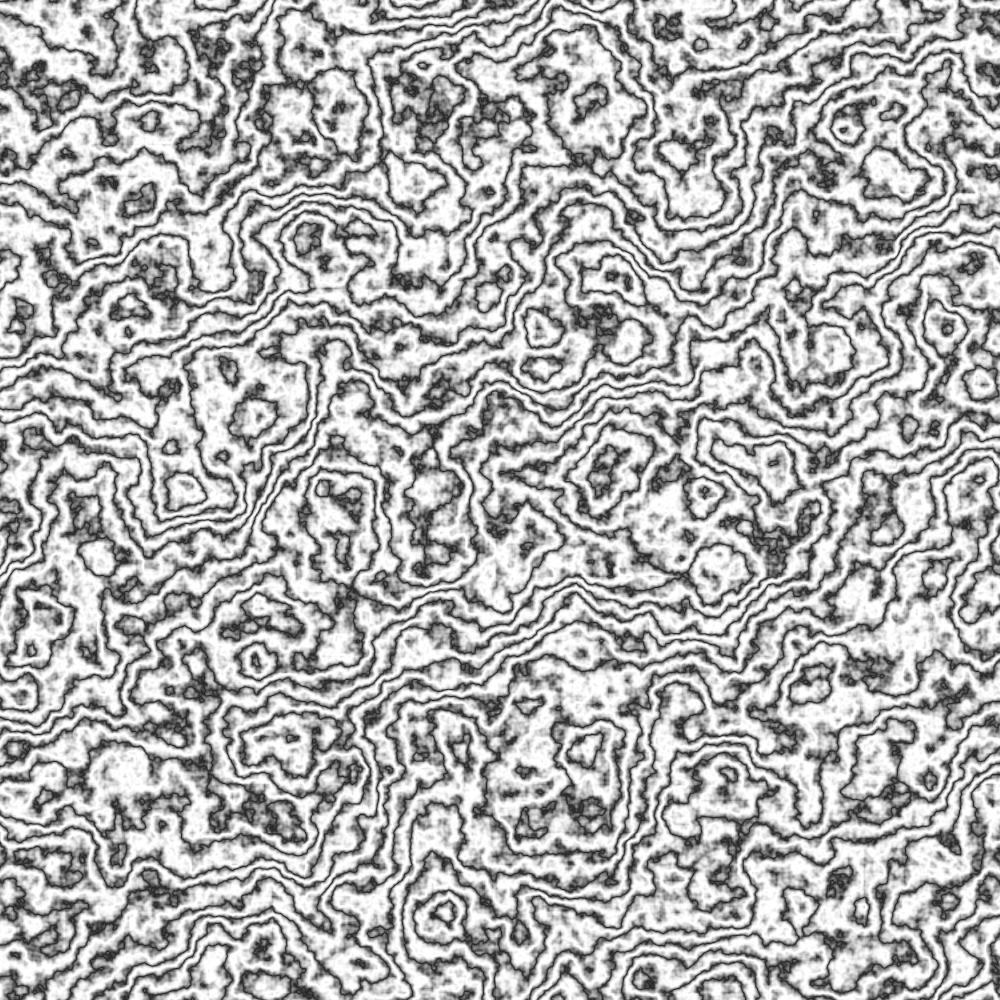

# Texture generation using Perlin's noise algorithm in Scala

## Perlin's noise algorihm

Perlin's noise is an algorithm that generates n-dimensional noise using gradients. When generating noise for 2d textures, the 2 dimensional variant of perlin's noise is used.

The algorithm is fairly simple, but the time complexity has a 2^n factor where n is the dimensional. For 2 dimensions this is a mere constant, but it can be a problem in higher dimensions.

Algorithm steps:
  1. generate a MxN grid of random unit-length gradients, 
  2. for each desired point in the grid calculate the distance to the surrounding 4 nodes of the grid and calculate the dot product of the distance and each gradient
  3. interpolate the 4 dot products, this will yield a value from [-1.0, 1.0], however, the energy is mostly in range [0.3, 0.7] so a function that will more uniformly scale the result can be used

## Image generation

Once the noise is generated we can  construct an image. Scaling the noise range to [0, 256) for each of the RGB colors will result in an image like the following. For each of the consequent images a 100x100 grid with 10 points between each nodes is used as a noise sample.

Obviously this doesn't look very natural, or useful even. So where do we go from here. When in doubt use recursion! In order to make the sample more natural we can blend the same image multiple with **itself** multiple times using different levels of zoom, starting with the upper left corner, and light level. Light level is reduced for each lesser zoom level in order to muffle the unnatural looking static.

For each pixel `(x, y)` we are going to combine several noise values. Say we want to start with zoom level `32`. We combine multiple noise points, giving less significance to the less zoomed points, using the following expression: `noiseAt(x.toDouble / currentZoom, y.toDouble / currentZoom) * currentZoom / 32`. In each iteration the current zoom is divided by 2 until it is at 1 ie. no zoom at all. The coordinate division yields a double. This double coordinate is then used to interpolate 4 noise points around it based on distance to assure that the zoomed values are not same for each pixel. Otherwise the pixels in range [0, 31] x [0, 31] would each refer to same point when zoomed in by a factor of 32 because we would use one exact noise point at `(0, 0)`, ie. integer division of `([0, 31] / 32, [0, 31] / 32)`.

Given this blending algorithm we can generate some better images.

Max zoom level of 8:

Max zoom level of 32:

Max zoom level of 64:

As you can see, by increasing the zoom level we make the image smoother because more parts are blended together.

And there it is. The 64 zoom level image could indeed be called a smoke texture. This is the simplest way of generating a texture. Usually the process is more elaborate and involves applying noise to some base texture.

# Texture generation using a base function

By applying noise to some base function we can generate more interesting images/textures. We can also fine tune the result by giving more/less significance to the noise as opposed to the base value generated by some function. The function we will look at is a simple sine. Here is what the base image looks like.

Adding some noise variation to this image will yield the following:

And finally, when we add some color and limit the color range we get some sand dunes!

Using the same sine function as a base, but with more noise and different coloring logic, we can also generate some stone-like textures. Note: for this case a 250x250 grid was used with 4 points in between each node. This means more rough edges in the image since there are more random gradients generated and less nicely inerpolated points in between them.

